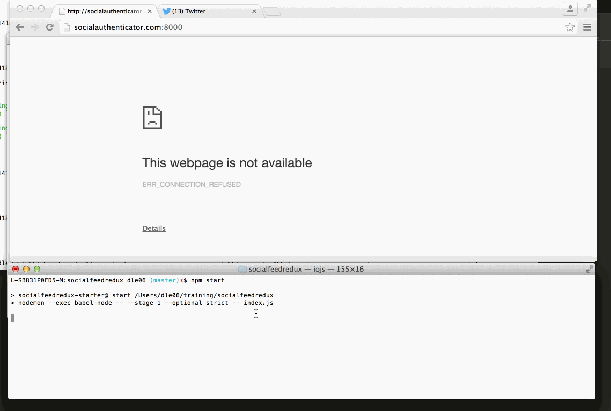

## SocialFeed Redux project

```
This is a real time update feed from Twitter.  It will automatically refresh using
socket io every 20 seconds.  Only new feed will be fetched then cached.

```

Time spent: `10`

#### Starting the application

```
npm install
npm start
```

### Features

#### Required

- [x] Periodically check Twitter for new posts and pass them to the connected clients
- [x] Refresh the client timeline in realtime (without a page refresh) using socket.io
- [x] Posts should be cached to minimize social network API requests
- [x] Social network API requests should only requests new posts (i.e., created after the lastest cached post)


### Walkthrough

